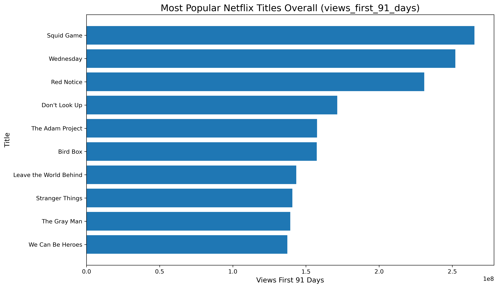
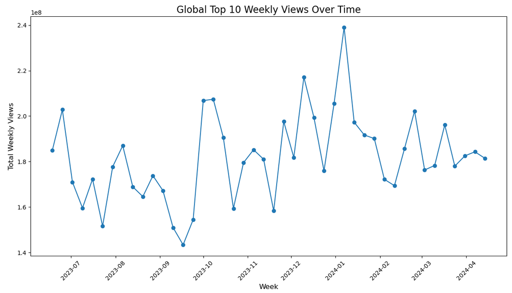
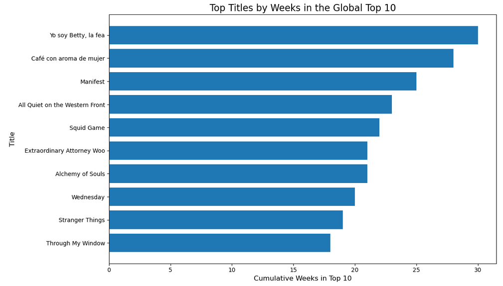
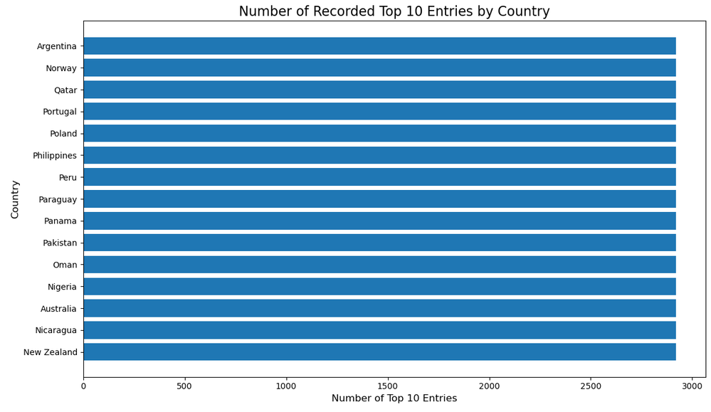
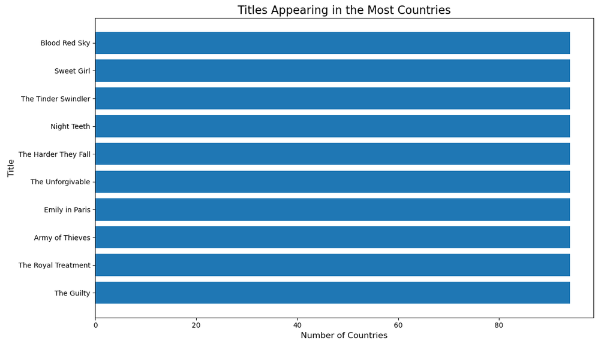
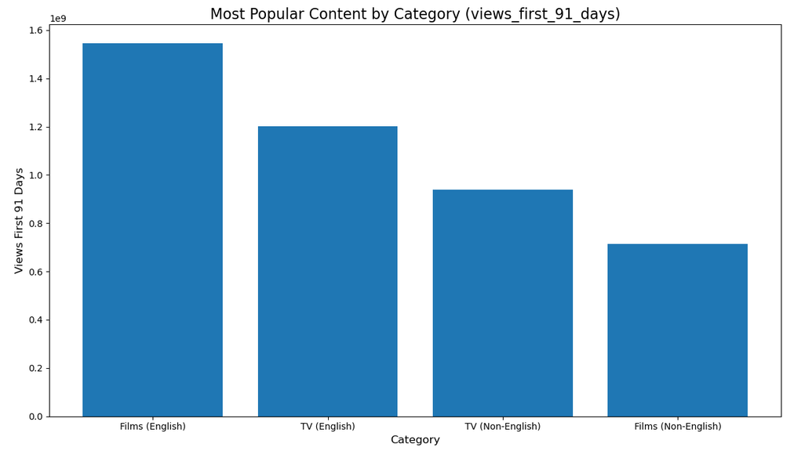
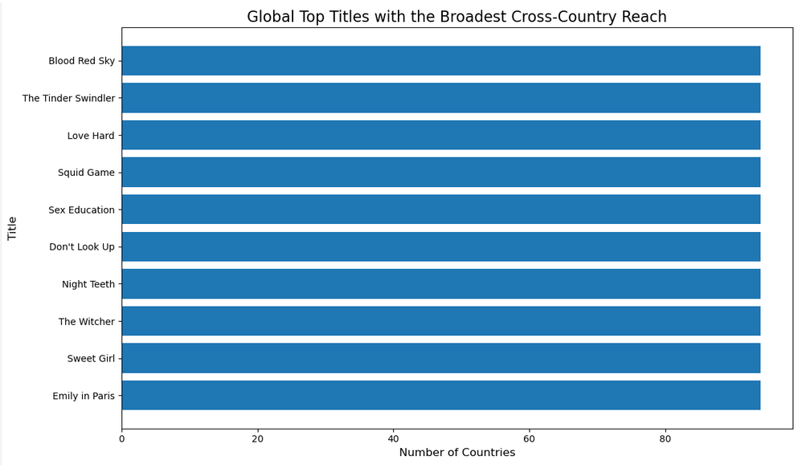

# Netflix Viewership Analysis



## Project Overview

This project examines Netflix Top 10 data to explore how titles perform across global and country-level markets. The analysis evaluates weekly viewing patterns, sustained Top 10 presence, geographic reach, content-category performance, and first-91-day popularity.

The project is designed for content-strategy and marketing audiences interested in identifying titles with broad international visibility and sustained audience interest. Its findings provide descriptive evidence for decision-making but do not establish that international reach causes commercial success.

## Questions Examined

The analysis addresses the following questions:

* How has recorded global Top 10 viewership changed over time?
* Which titles remained in the global Top 10 for the greatest number of weeks?
* How is country-level Top 10 coverage distributed in the dataset?
* Which titles appeared in the greatest number of countries?
* How do films and television series compare in the Most Popular dataset?
* Which titles accumulated the greatest number of views during their first 91 days?
* Which titles appear in both the global and country-level Top 10 data?

## Datasets

- `all-weeks-countries-netflix.xlsx`
- `all-weeks-global-netflix.xlsx`
- `most-popular-netflix.xlsx`

Dataset source: [Netflix Top 10 data](https://www.netflix.com/tudum/top10/data)

Key variables include:

* Week
* Country
* Category
* Weekly rank
* Show title
* Weekly views
* Weekly hours viewed
* Cumulative weeks in the Top 10
* Runtime
* Views during the first 91 days

[View Netflix Top 10 data](https://www.netflix.com/tudum/top10/data)

## Analysis Process

The analysis was completed in Python using a Jupyter Notebook. The process included:

1. Loading and validating three Excel datasets.
2. Reviewing dataset dimensions and column names.
3. Standardizing column labels and title formatting.
4. Converting week fields to dates.
5. Converting ranking and viewership fields to numeric values.
6. Removing periods without a reported viewership measure from the applicable time-series analysis.
7. Examining global Top 10 viewing patterns over time.
8. Identifying titles with sustained global Top 10 presence.
9. Comparing country-level dataset coverage.
10. Measuring the number of countries in which each title appeared.
11. Comparing content-category performance.
12. Identifying the most-viewed titles during their first 91 days.
13. Examining overlap between global and country-level Top 10 titles.

Reusable helper functions were created to normalize column labels and locate comparable variables across files with different schemas.

## Principal Findings

* Global Top 10 viewership varies substantially over the period covered by the data.
* Some early records do not contain the selected viewership measure and should not be interpreted as zero viewing activity.
* Cumulative weeks in the Top 10 distinguish titles with sustained visibility from titles experiencing shorter periods of high performance.
* Many countries contain the same number of Top 10 records, indicating that record counts largely reflect common reporting periods and dataset coverage rather than differences in audience size.
* Several titles appeared in 94 countries, including *Blood Red Sky*, *Sweet Girl*, *The Tinder Swindler*, *The Harder They Fall*, and *The Unforgivable*.
* *Squid Game* had the highest first-91-day view count in the Most Popular dataset, followed by *Wednesday* and *Red Notice*.
* Titles appearing in both the global and country-level datasets demonstrate broad geographic visibility, although this analysis does not establish that geographic reach causes higher viewership or financial returns.

## Visualizations

### Global Top 10 viewership over time



The time-series visualization examines recorded global Top 10 viewing activity while excluding periods without the selected viewership measure.

### Titles with sustained Top 10 presence



Cumulative weeks in the Top 10 provide a measure of sustained chart presence rather than a direct measure of total audience size.

### Country-level dataset coverage



This chart compares the number of recorded Top 10 entries by country. Similar totals primarily reflect dataset coverage and should not be interpreted as audience-size rankings.

### Titles appearing in the most countries



Several titles appeared across 94 countries, showing broad geographic distribution within the country-level Top 10 data.

### Content-category performance



This visualization compares the performance measure available for films and television series in the Most Popular dataset.

### Most popular titles


The chart ranks titles using views accumulated during their first 91 days.

### Cross-market title overlap



This visualization identifies titles appearing in both the global and country-level Top 10 datasets and ranks them by geographic reach.

## Technologies

* Python
* Jupyter Notebook
* pandas
* NumPy
* Matplotlib
* openpyxl

## Repository Contents

| Folder or file     | Contents                                                            |
| ------------------ | ------------------------------------------------------------------- |
| `analysis`         | Jupyter Notebook containing the complete analysis and saved outputs |
| `data`             | Three Netflix Top 10 Excel workbooks                                |
| `images`           | Portfolio-ready visualizations generated from the analysis          |
| `presentation`     | Narrative presentation of the analysis                              |
| `requirements.txt` | Python packages required to run the notebook                        |

## Project Materials

* [View the complete Jupyter Notebook](analysis/Netflix_Viewership_Analysis.ipynb)
* [View the project presentation](presentation/Netflix_Viewership_Analysis_Presentation.pptx)
* [View the country-level dataset](data/all-weeks-countries-netflix.xlsx)
* [View the global dataset](data/all-weeks-global-netflix.xlsx)
* [View the Most Popular dataset](data/most-popular-netflix.xlsx)

## Running the Analysis

### Requirements

Python 3 is required to run the analysis.

Clone the repository:

```bash
git clone https://github.com/ferrillt/Netflix-Viewership-Analysis.git
```

Move into the repository:

```bash
cd Netflix-Viewership-Analysis
```

Install the required packages:

```bash
pip install -r requirements.txt
```

Move into the analysis folder:

```bash
cd analysis
```

Start Jupyter Notebook and open the analysis:

```bash
jupyter notebook Netflix_Viewership_Analysis.ipynb
```

Run the notebook cells in order. The notebook reads the three Excel workbooks from the adjacent `data` folder.

## Assumptions and Limitations

* Netflix Top 10 data represent ranked titles rather than all content available on the platform.
* The datasets do not include subscriber demographics, production costs, marketing expenditures, licensing arrangements, or revenue.
* Some historical records lack the selected viewership measure and are excluded from the applicable trend calculation rather than treated as zero.
* The number of country-level records may reflect reporting coverage and observation periods rather than differences in audience engagement.
* Appearing in more countries does not necessarily mean that a title received more views in each country.
* Cumulative weeks in the Top 10 measure sustained ranking presence but do not capture all dimensions of popularity.
* First-91-day views and weekly Top 10 measures describe different observation periods and should not be treated as directly equivalent.
* The results identify descriptive patterns and associations but do not establish causation.
* The analysis cannot determine whether a title generated a positive financial return.

## Ethical Considerations

The project uses aggregated title-level and country-level data rather than individual viewing histories. It does not attempt to identify subscribers or infer personal viewing behavior.

Country-level comparisons are presented carefully because differences may reflect dataset coverage, market availability, and reporting periods. The analysis avoids equating Top 10 appearances with audience size or using geographic reach as proof of commercial success.

## Potential Enhancements

Future work could:

* Compare views after normalizing for the number of reporting weeks.
* Examine changes in content performance by year.
* Compare geographic reach across languages and genres.
* Incorporate production budgets and marketing costs when available.
* Evaluate whether sustained Top 10 presence is associated with first-91-day views.
* Develop an interactive dashboard for filtering by country, category, title, and reporting period.
* Add statistical testing to evaluate relationships among geographic reach, viewing activity, and sustained Top 10 presence.

## References

Cairo, A. (2016). *The truthful art: Data, charts, and maps for communication*. New Riders.

Knaflic, C. N. (2015). *Storytelling with data: A data visualization guide for business professionals*. Wiley.

Kuhn, M., & Johnson, K. (2019). *Feature engineering and selection: A practical approach for predictive models*. CRC Press.

Netflix. (n.d.). *Netflix Top 10*. https://www.netflix.com/tudum/top10/data

## Author

Teresa Ferrill
